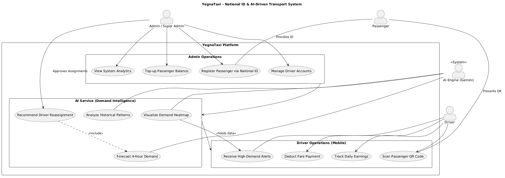

# Integrated Digital Payment and Fare Management System for Shared Urban Transport

## Abstract

The Integrated Digital Payment and Fare Management System is a secure, inclusive, and efficient platform designed to modernize fare collection in shared urban transport. By leveraging a national id BARcode-scan based strategy, the system eliminates the inefficiencies of cash-based transactions—such as delays, worn-out or torn cash notes, security risks, and lack of transparency—while ensuring that all users are fully integrated into the digital economy.
**AI Integration And Involvment On The Project**

**AI-Driven Demand Analysis and Prediction:**
The system integrates artificial intelligence to analyze passenger activity and identify high-demand routes and hotspots based on real-time and historical transaction data. By observing usage patterns over time—including daily and weekly trends—the AI predicts future demand and provides proactive recommendations to administrators. This enables efficient allocation of drivers in advance, reducing congestion, minimizing passenger wait times, and improving overall service reliability and most importantly contributing to enhanced traffic congestion.

---

## The Current Cash Based System Problem

Traditional shared transport (minibuses and taxis) in urban centers in Ethiopia remains trapped in a **cash-only cycle**, leading to systemic operational failures:

- **Operational Inefficiency:** Manual change-making causes boarding delays,

- **Revenue Leakage:** Lack of digital tracking results in an huge amount due to unverified payments and disputes.
- **Security Risks:** Drivers are forced to carry large amounts of physical cash , making them prime targets for theft and loss.
- **Inefficient Route and Station Allocation:** The absence of data-driven analysis and AI-based planning leads to poor distribution of stations and routes, resulting in overcrowding in some areas and underutilization in others.

---

## How It Solves the Problem

Our system transforms chaotic cash handling into a streamlined instant transaction through a multi-stakeholder ecosystem:

1. **National ID–Based QR Strategy (Universal Access):**
   The system adopts a unified NationalId BARcode-based approach that enables nationwide accessibility by leveraging the unique FAIDA ID (National Identification Number). Each user is registered using their FAIDA ID, which is used to generate a unique, secure BARcode(embedded in the national id) identity linked to their digital wallet. It ensures that any individual with a valid national ID can seamlessly access and use the system for fare payments.

2. **AI realtime analysis and prediction** . The system first analyzes live transaction data to identify high-demand routes and stations, dynamically flagging them as hotspots. Based on this real-time insight, it provides actionable recommendations to administrators, such as reallocating drivers to areas experiencing high passenger demand.
   In addition, the system incorporates predictive AI capabilities that analyze historical transaction data, including recurring patterns such as peak hours, weekends, holidays, and irregular events. Using these insights, the system forecasts future demand and proactively suggests optimal driver distribution. This dual approach—combining real-time analysis with predictive intelligence—enables efficient resource allocation, reduces congestion, and helps mitigate traffic-related challenges.
3. **Instant Revenue Tracking:** Drivers scan passenger Barcodes and receive instant confirmation, eliminating fare disputes and providing real-time earning reports.
4. **Secure Wallet Ecosystem:**
   Passengers can securely top up their digital wallet balances through authorized administrators, ensuring a reliable and well-managed account for seamless fare transactions.
5. **Automated Accountability:** A centralized web portal provides administrators with real-time analytics.

## ✨ Why We Are Unique

summarie of the current system and our proposed system comparison
| Feature | Traditional Systems | **Our System** |
| :---------------------- | -------------------- | -------------------------------- |
| **User Reach** | Cash-only | **Everone with nationalId** |
|**Traffic suggestion** |Absent | **Strong suggestion and AI prediction** |
| **Transaction Speed** | Slow (Change-making) | **Instant (<2-second Scan)** |
| **Stakeholder Synergy** | Fragmented | **Unified (Driver/Agent/Admin)** |
| **Revenue Security** | High Risk (Theft) | **High (Atomic Transactions)** |

> **"We don't just digitize payments; we make everyone to have access to the modern digitalized payment"**

---

The overall work flow of the system visualized

## 🛠️ Technology Stack

- **Backend:** Node.js, Express, Prisma ORM
- **Database:** PostgreSQL
- **Mobile App:** Flutter, Riverpod (Cross-platform for Android/iOS)
- **Web Admin:** React.js, Tailwind CSS

te## 👥 Stakeholders

- **Passengers:** Cashless convenience via NationalId.
- **Drivers:** Real-time earning tracking and reduced security risks.
- **Admins:** Data-driven oversight and automated payout management.

---

---

_Developed by Betremariam Yihenew and Surafel Muhabaw (2018)._
